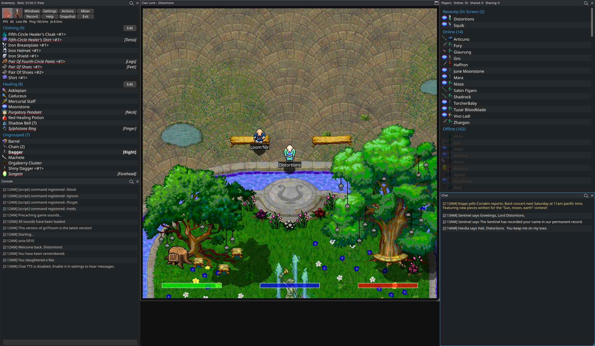

# goThoom

[](https://goreportcard.com/report/github.com/Distortions81/goThoom)
[](LICENSE)
[](https://github.com/Distortions81/goThoom/releases)

An open-source (MIT) client for the classic **[Clan Lord](https://www.deltatao.com/clanlord/)** MMORPG

Approximately 67,000 lines of Go code (including tests).

Desktop release builds are available for Windows x86-64, macOS on Apple Silicon and Intel, and Linux x86-64 via [Ebitengine](https://ebitengine.org/). An experimental WebAssembly browser package can be built separately.

[Website](https://gothoom.m45sci.xyz/)

[Video Overview](https://youtu.be/MrGdcqIl3a4)




> Status: actively developed, cross-platform builds provided in Releases.

---

## Why I made this

- The Windows client is finicky
- 3–5 FPS with LCD popping/strobing effects are very hard to look at. I personally really struggle with motion sickness from it.
- The art assets make heavy use of dithering that looked great on small CRTs but look entirely different (and unpleasant) on modern displays without filtering.
- The game window was not resizable (547×540) and didn't look good or fit well on most screens, even with OS/VM scaling
- QuickTime MIDI is dead on modern macOS
- QuickTime for Windows is unsupported past Windows 7 (last updated in 2009) and is a real security risk
- A number of security concerns with the old client
- Other functioning clients are single-platform and closed-source
- Input schemes are odd or outdated
- Macros seem to be mandatory to keep up. Most available are ancient, difficult to find, and require fiddling in an odd macro language

## What does goThoom offer?

- Optional interpolation for smooth movement at any frame rate, with a trade-off of more positional latency (animations and sounds are unaffected)
- Texture processing that intelligently smooths dithering to restore a more CRT-like look to revive lurking color information and reduce popping/strobing effects when moving
- Animation frame blending for a much smoother, more pleasant experience that helps the existing animations look their best
- High-quality adjustable game window resizing that retains sharpness with very few artifacts
- High-quality audio processing for the original recordings
  - Resampling: 1024-phase, 8-tap Lanczos-4 windowed sinc
  - Bit-depth conversion: TPDF dithering with 257 scaling for 8-bit to 16-bit conversion
  - Optional game-sound enhancement plus persistent music reverb and stereo placement for simultaneous bard parts
- `.clmov` recording and playback with seeking, so you can capture sessions and jump through recordings without replaying them from the start
- A modern music synthesizer using an optional downloadable SoundFont instead of QuickTime MIDI
- Built-in local Piper text-to-speech with a large choice of voices available online
- Anti-aliased text rendering with high-quality modern OpenType fonts and fractional font sizes
- Dark mode, light mode or fun colorful themes (even create your own)
- Platform-native graphics backends through Ebitengine, including DirectX on Windows and Metal on macOS
- Portable release archives with no installer; core game data and optional music/TTS files are downloaded separately
- MIT-licensed open source to help prevent the client from becoming unmaintained abandonware
- A built-in legacy macro library alongside the Go scripting system
- Powerful scripting system using a common language, meaning most users will be able to seek support from LLMs.
- Choices for more modern input schemes like enter-to-talk, WASD and use of non-fkeys
  - Modern laptops often do not support touchpad + keyboard simultaneously (palm rejection)
  - Many modern PCs only have media keys and require a function key or mode switch to use F-keys. Some offer only touch-screen F-keys or none at all.

---

## Download
**Easiest:** grab the latest build from **Releases** on this repo (Windows, macOS, Linux).

## Quick start
- The client **auto-fetches missing or outdated game assets** (images and sounds) into `data/`.
- A short setup wizard opens on first run and once for each new goThoom release. Every control starts from the user's current setting, and changes are shown immediately in the live offline preview.

### Optional extras
- **Background and splash images** – place `background.png` and/or `splash.png` in `data/` to override the default visuals.
- **Sound font** – drop a `soundfont.sf2` file into `data/` to change the music instrument set. The Download Files window can fetch a suitable one.
- **TTS voices** – voice archives (`.tar.gz`) or `.onnx` models with matching `.onnx.json` configs belong in `data/piper/voices`. Use `build-scripts/download_piper.sh` or the Download Files window to grab voices from online collections.

### Custom themes and styles
Themes live in `themes/palettes` and styles in `themes/styles`. On first run the client writes an `Example.json` palette and style plus a README explaining the format. Copy these files, adjust the colors or geometry, and select your new theme in Settings. With `eui.AutoReload = true` changes on disk are picked up automatically.

### Text-to-speech voices
Piper voices are stored in `data/piper/voices`. The client and `build-scripts/download_piper.sh` support voice archives in `.tar.gz` format and automatically extract and remove the archives. If a voice archive isn't available, the program falls back to downloading raw `.onnx` models with matching `.onnx.json` configs.

### Downloading TTS files and soundfonts
Use the **Download Files** window to fetch optional resources. The TTS option downloads the Piper binary and English voices for chat speech, while the SoundFont enables higher-quality music playback. The SoundFont option starts checked; the larger Piper TTS download is opt-in.

### Low-end hardware
Enable **Potato GPU (low VRAM)** in Settings → Graphics if your system or driver only supports textures up to 4096×4096 pixels (for example, Raspberry Pi or very old GPUs). This mode uses smaller textures to avoid driver issues.

## Using the UI

- Windows: Click the `Windows` toolbar button to toggle common panels: Players, Inventory, Chat, Console, Help, Hotkeys, Shortcuts, Mixer, Settings, and more. Window layout and open/closed state persist between runs.
- Actions: Use the `Actions` toolbar drop-down for Hotkeys, Shortcuts, Triggers, Scripts, or Legacy Macros. Dedicated buttons provide quick access to Settings, Record, Help, Snapshot, Mixer, and Exit.
- Movement: Left-click to walk, or use WASD/arrow keys (hold Shift to run). An optional "Click-to-Toggle Walk" sets a target with one click.
- Input bar: Press Enter to type; press Enter again to send. Esc cancels. Up/Down browse history. While typing, Ctrl-V pastes and Ctrl-C copies the whole line. Right-click the input bar for Paste / Copy Line / Clear Line (Paste and Clear switch to typing mode and refresh immediately).
- Chat/Console: Chat and Console are separate windows by default. Right-click any chat or console line to copy it; the line briefly highlights. You can merge chat into the console in Settings.
- Inventory: Single-click selects. Double-click equips/unequips; Shift + double-click uses. Right-click an item for a context menu: Equip/Unequip, Examine, Show, Drop, Drop (Mine). If a shortcut is assigned to an item, its key appears like `[Q]` before the name.
- Players: Single-click selects a player. Right-click a name for Thank, Curse, Anon Thank…, Anon Curse…, Share, Unshare, Info, Pull, or Push. Tags in the list: `>` sharing, `<` sharee, `*` same clan.
- Mixer: Adjust Main, Game, Music, TTS, and notification volumes; enable or disable channels; mute when unfocused; and toggle stereo music.
- Quality: Pick a preset, or tweak motion smoothing, denoising, blending.
- Setup Wizard: Reopen the release tour at any time from Settings. Completing or skipping it records the current goThoom release in `settings.json`, so it returns only after the next upgrade.

### Settings file

`data/settings.json` uses schema version 4. Settings are grouped into plainly named sections such as `controls`, `interface`, `rendering`, `audio`, `notifications`, and `windows`, with lower-case snake-case option names. Choices that were previously numeric are readable strings; for example, `rendering.artwork_upscale_style` accepts `off`, `crisp`, `balanced`, `smooth`, or `ultra_smooth`.

The client loads older flat settings files (versions 1 through 3), preserves their values, and rewrites them in the categorized version 4 format on the next automatic settings save.

Tip: The input bar auto-expands as you type and has a context menu for quick paste/copy/clear.

---

## Scripts

goThoom can load optional scripts at startup using [yaegi](https://github.com/traefik/yaegi), a Go interpreter.
Place `.go` files inside the `scripts/` directory.

### Legacy `.mac` macros

Open **Actions → Legacy Macros** to browse the public legacy macro library
embedded in the client. The first time it opens, the bundled sources are copied
to `Macros/Library/` without overwriting anything. Every `.mac` file in that
directory then appears in the list, including files you add yourself.

- Optional comment metadata gives macros a friendly name, description, and
  tags. Tags are separated with commas. Copy the simple template and real
  example in [METADATA.md](source/testdata/legacy_macros/web/METADATA.md). The same
  guide is installed as `Macros/Library/METADATA.md`.
- **Global** and selected **Player** checkboxes are saved in
  `Macros/Library/enabled.json`. They tell goThoom which library files to load
  and never rewrite `Macros/Default` or `Macros/<player name>`.

Changing a checkbox reloads the active macro program immediately. After
editing a `.mac` file, use **Reload Macros** in the Legacy Macros window.
The **i** button shows each bundled macro's author and source links. Remaining
compatibility work is tracked in `MACRO_COMPAT_TODO.md`.

Legacy macro files and server messages use MacRoman, while goThoom keeps normal
text as Unicode internally. See
[Legacy text compatibility](docs/LegacyTextCompatibility.md) for the Unicode
escape format, examples, and round-trip behavior.

Very old `undo` key bindings need a different key on modern keyboards. Mouse
buttons beyond the five reported by the client cannot trigger a macro.

### Testing server messages

Use the `/testhooks` command to inject fake server messages for debugging or
script development. Run `/testhooks help` to see available message names.

```
/testhooks MESSAGE [NAME] DATA
```

`MESSAGE` is a server message name like `share` or `info`. Supply `NAME`
for messages referencing a mobile, and put the message body in `DATA`. Running
`/testhooks` without arguments emits a few sample messages.

Available message types:

| Name | Tag | Description |
|------|-----|-------------|
| bard | ba | bard message |
| backend | be | back-end command |
| clan | cn | clan name |
| config | cf | config |
| nodisplay | dd | do not display |
| demo | de | demo notice |
| depart | dp | depart |
| download | dl | download |
| error | er | error message |
| gm | gm | game master |
| fallen | hf | has fallen |
| notfallen | nf | no longer fallen |
| info | in | info |
| inventory | iv | inventory |
| karma | ka | karma |
| karmarecv | kr | karma received |
| logoff | lf | log off |
| logon | lg | log on |
| location | lo | location |
| multi | ml | multilingual |
| monster | mn | monster name |
| music | mu | music |
| news | nw | news |
| player | pn | player name |
| share | sh | share |
| unshare | su | unshare |
| textlog | tl | text log only |
| think | th | think |
| mono | tt | monospaced style |
| who | wh | who list |
| youkilled | yk | you killed |

---
## Build from source

1. Install system packages:
   ```bash
   sudo apt-get install -y build-essential libgl1-mesa-dev libglu1-mesa-dev \
     xorg-dev libxrandr-dev libasound2-dev libgtk-3-dev xdg-utils
   ```
2. Install Go 1.26.6 from [go.dev](https://go.dev/dl/).
3. Download and extract the prebuilt dependency bundle from the repository root:
   ```bash
   curl -LO https://m45sci.xyz/u/dist/goThoom/gothoom_deps.tar.gz
   tar -C source -xzf gothoom_deps.tar.gz
   ```
4. Download Go modules:
   ```bash
   cd source
   go mod download
   ```
5. Build the client:
   ```bash
   go build
   ```

The complete Go module lives in `source/`, including the client, shared
packages, scripts, assets, and tests.

### Update the project screenshot

After adding a screenshot to `dev-screenshots/`, update both this README and
the website copy with:

```bash
./build-scripts/update_screenshot.sh dev-screenshots/Screenshot.png
```

The helper requires `cwebp`, provided by the `webp` package.

### Build the WebAssembly package

WebAssembly is kept separate from the desktop release build:

```bash
./build-scripts/build_wasm.sh
```

The browser package is written to `binaries/goThoom-Web/`.

### Setup wizard graphics preview

While the setup wizard is open offline, a synthetic scene runs directly through the normal game renderer. It demonstrates daytime, nighttime, indoor, glow, shadow, animation-blending, motion-smoothing, health, and speech-bubble settings without playing a hidden movie. Graphics detection temporarily bypasses VSync and observes the complete renderer for five seconds before recommending Full Quality or the iGPU preset.

### Build with Docker (cross compile capable)

A `Dockerfile` provides a reproducible cross-platform build environment.

```bash
./build-scripts/docker_dev_env.sh
docker create --name gothoom-build gothoom-build-env
mkdir -p dist
docker cp gothoom-build:/binaries/. ./dist/
docker rm gothoom-build
```

The `dist/` directory will contain the compiled binaries.
See [`docs/Docker.md`](docs/Docker.md) for details.

---

## License

MIT. Game assets and “Clan Lord” are property of their respective owners; this project ships **a client**, not server content.

---

## Credits

Built in Go with a sprinkle of pragmatism and a lot of late-night packet spelunking. If you enjoy this, star the repo or link it.
