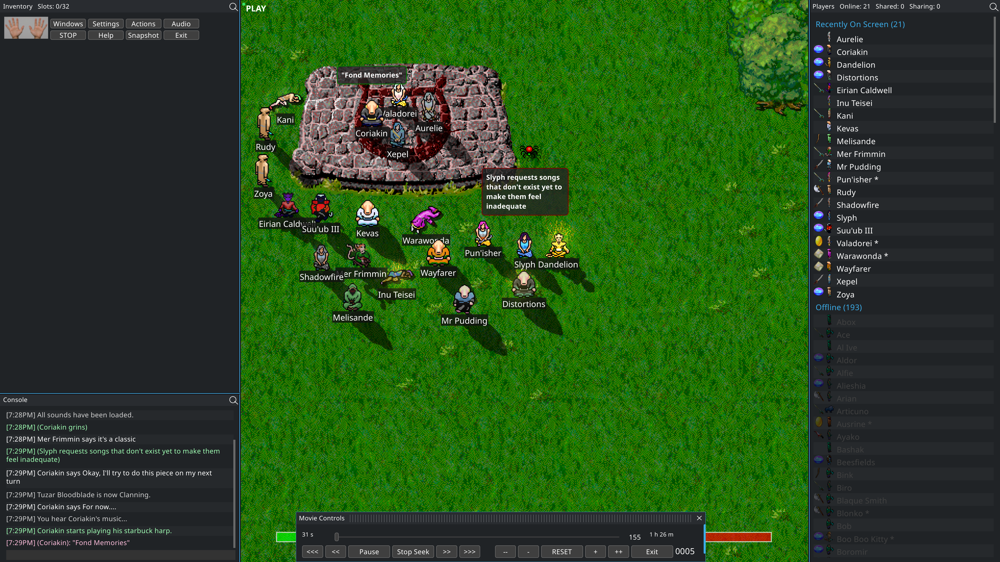

# goThoom

goThoom is a modern, open-source client for the classic
[Clan Lord](https://www.deltatao.com/clanlord/) MMORPG. It runs on Windows,
macOS, and Linux.

[Download the latest release](https://github.com/Distortions81/goThoom/releases/latest)
· [Website](https://gothoom.m45sci.xyz/)
· [Video overview](https://youtu.be/MrGdcqIl3a4)

## Get started

1. Download the archive for your platform from
   [Releases](https://github.com/Distortions81/goThoom/releases/latest).
2. Extract the archive anywhere you like.
3. Run goThoom. No installer is required.

Missing or outdated game assets are downloaded automatically into `data/`.
The first-run setup wizard previews graphics changes and recommends settings
for your computer.

## Highlights

- Smooth movement, animation blending, and optional artwork processing.
- A resizable game view that stays sharp on modern displays.
- Modern game audio, MIDI playback and optional text-to-speech.
- Session recording and `.clmov` playback with speed and seeking.
- Configurable windows, controls, shortcuts, notifications, and themes.
- Built-in legacy macro support and an approachable Go scripting system.
- Native graphics backends, including DirectX on Windows and Metal on macOS.
- Portable release archives with no installer.

## Using goThoom

- **Movement:** Left-click in the game view to walk toward the cursor.
- **Chat:** Press Enter to start typing and Enter again to send. Escape cancels;
  Up and Down browse message history.
- **Windows:** Use the **Windows** toolbar menu to open Players, Inventory,
  Chat, Console, Help, Hotkeys, Shortcuts, Mixer, Settings, and other panels.
- **Inventory:** Click to select, double-click to equip or unequip, and
  Shift-double-click to use. Right-click for more actions.
- **Players:** Right-click a player for common actions such as Thank, Share,
  Info, Pull, and Push.
- **Copying text:** Right-click a chat or console line to copy it. The input bar
  also has a right-click menu for paste, copy, and clear.
- **Audio:** Use the Mixer to control game, music, speech, and notification
  volume independently.

The in-game Help window covers commands and controls in more detail. A command
reference is also available in [docs/CommandsHelp.md](docs/CommandsHelp.md).

## Downloads and customization

Open **Download Files** in the client to install optional extras:

- A SoundFont for higher-quality music.
- Piper voices for local text-to-speech.

You can also customize goThoom without modifying the program:

- Place `background.png` in `data/` to use a custom background.
- Put custom color palettes in `themes/palettes/` and styles in
  `themes/styles/`. Example files and format documentation are created for you.
- Enable **Potato GPU (low VRAM)** in Settings → Graphics on devices with small
  texture limits, such as Raspberry Pi or older GPUs.

## Macros and scripts

### Legacy macros

Open **Actions → Legacy Macros** to browse the bundled macro library. Enable a
macro globally or for a selected character. Use **Refresh List** after adding,
removing, or renaming files, and **Reload Macros** after editing an enabled
macro. Your own `.mac` files can be added to `Macros/Library/`. Enable
**Allow continuous macros** for classic macros that intentionally loop without
pausing or producing output.

Macro metadata and examples are documented in
[METADATA.md](source/testdata/legacy_macros/web/METADATA.md). Legacy text
encoding details are in
[LegacyTextCompatibility.md](docs/LegacyTextCompatibility.md).

### Go scripts

Open **Actions → Scripts** to configure, validate, reload, or stop scripts.
Scripts may be a single `.go` file, a folder with assets, or a ZIP package. The
embedded examples are copied to an empty `data/Scripts` folder and never replace
existing scripts.

Script-author documentation lives in
[source/script_library/README.md](source/script_library/README.md), with the complete API in
[source/gt2/API_REFERENCE.md](source/gt2/API_REFERENCE.md).

For VS Code completion and type checking, download
[`goThoom-Script-Template.zip`](https://github.com/Distortions81/goThoom/releases/latest/download/goThoom-Script-Template.zip)
from the latest release.

## License

goThoom is released under the [MIT License](LICENSE). Clan Lord and its game
assets belong to their respective owners; this repository provides a client,
not server content.

## Credits

Built in Go with a sprinkle of pragmatism and a lot of late-night packet
spelunking. If you enjoy goThoom, consider starring the repository or sharing
it with another Clan Lord player.
